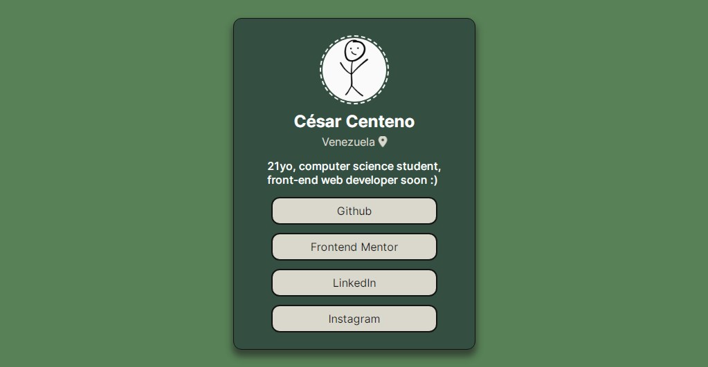

# Frontend Mentor - Social links profile solution

This is a solution to the [Social links profile challenge on Frontend Mentor](https://www.frontendmentor.io/challenges/social-links-profile-UG32l9m6dQ). Frontend Mentor challenges help you improve your coding skills by building realistic projects. 

## Table of contents

- [Overview](#overview)
  - [The challenge](#the-challenge)
  - [Screenshot](#screenshot)
  - [Links](#links)
- [My process](#my-process)
  - [Built with](#built-with)
  - [What I learned](#what-i-learned)
  - [Continued development](#continued-development)
  - [Useful resources](#useful-resources)
- [Author](#author)
- [Acknowledgments](#acknowledgments)

## Overview

### The challenge

Users should be able to:

- See hover and focus states for all interactive elements on the page

### Screenshot

### Links

- [Solution URL](https://your-solution-url.com)
- [Live site](https://6xg0d.github.io/social-links-profile-challenge/)

## My process

This challenge was so fun to do! The use of flexbox helped me to create the layout, and a little bit of semantic HTML to create the structure. 

### Built with

- Semantic HTML5 markup
- CSS
- Flexbox

### What I learned

I learned about how to change the type of cursor with css, practice a little bit to add icons, and i learn how to add animations to the fontawesome icons! Also i tried to use a color palette that has a good contrast for accesibility!

### Continued development

I'd like to add more socials in the future, and also add even interactive elements and animations :)

### Useful resources

- [Fontawesome](https://fontawesome.com/) - This helped me with the map icon.
- [w3schools](https://www.w3schools.com/cssref/pr_class_cursor.php) - This is an amazing article which helped me to understand the types of cursors and how to change it with css.
- [Coolors](https://coolors.co/) - I used it to find a good color palette.
- [Coolors Contrast Checker](https://coolors.co/contrast-checker/000000-a3b18a) - I used it to check the contrast between colors for accesibility.

## Author

- Frontend Mentor - [@6xg0d](https://www.frontendmentor.io/profile/6xg0d)

## Acknowledgments

Big thanks to @perterHUAN who gave me a lot of tips and feedback with the Blog Card Preview Challenge. It helped me a lot! Specially the padding tip to avoid using innecesary margins in every container like the previous challenge. Thanks! ;)
